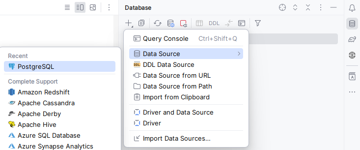

# A-Geld
### WEB и мобильное приложение дистанционного банковского обслуживания клиентов A-Geld- Банка.

## Описание проекта

Система позволит клиентам получить информацию о банковских продуктах (кредиты, депозиты, карты),
совершать платежи, к примеру, оплачивать услуги интернет-связи и цифрового телевидения, коммунальные услуги. С помощью СДБО можно будет пополнять счета электронных кошельков, совершать платежи по произвольным реквизитам, переводы между вкладами и банковскими картами, а также осуществлять переводы средств клиентам Банка и других банков, обмен валюты, а также оформлять новые банковские продукты.

## Архитектура сервисов
* api-gateway
* config-service
* customer-service
* discovery-service
## Технологии
* Java 17
* Spring / Spring Boot / Spring Security / Spring Cloud
* Gradle
* Hibernate ORM
* PostgreSQL
* Redis
* Lombok
* Mock junit
* Integration testing
* Docker
* GitLab

## Требования

Для успешной настройки и запуска контейнеров Docker с этим проектом, у вас должны быть установлены следующие программы:
* [Java (RUS)](https://itproger.com/course/java/2)  : Инструкция по установке Java
* [IntelliJ IDEA Ultimate (Trial) (ENG)](https://www.jetbrains.com/help/idea/installation-guide.html)  : Инструкция по установке IntelliJ IDEA
* [Docker (ENG)](https://www.docker.com/) : Docker Desktop


## Развертывание проекта в Docker

### Создайте локально пустой репозиторий "A-Geld", в него склонируйте репозитории:
<details><summary> Clone with HTTPS </summary>

```
git clone https://git.astondevs.ru/laboratory/a-geld/java-dev/api-gateway.git
```
```
git clone https://git.astondevs.ru/laboratory/a-geld/java-dev/config-service.git
```
```
git clone https://git.astondevs.ru/laboratory/a-geld/java-dev/customer-service.git
```
```
git clone https://git.astondevs.ru/laboratory/a-geld/java-dev/discovery-service.git
```
</details>

<details><summary> Clone with SSH </summary>

```
git clone git@git.astondevs.ru/laboratory/a-geld/java-dev/api-gateway.git
```
```
git clone git@git.astondevs.ru/laboratory/a-geld/java-dev/config-service.git
```
```
git clone git@git.astondevs.ru/laboratory/a-geld/java-dev/customer-service.git
```
```
git clone git@git.astondevs.ru:laboratory/a-geld/java-dev/discovery-service.git
```
</details>

В случае недоступности репозитория необходимо получить доступ.
### Откройте проект(A-Geld) в IntelliJ IDEA
### Запустите Docker Desktop
### Запустите "docker-compose up" в "docker-compose-dev.yaml" - он находится в customer-service.


По окончанию разветывания приложения вы можете открыть веб-браузер и перейти по адресу http://localhost:8082 для доступа к вашему приложению.

### Подключение к базе данных в IntellIJ IDEA

Вы можете подключиться к развернутой в Docker базе данных через IntelliJ IDEA

<details>
  <summary>Инструкция</summary>

##### 1. Нажимаем Database->New->Data Source->PostgreSQL



##### 2. Заполняем колонки Database, User, Password - данные по ссылке:
https://git.astondevs.ru/laboratory/a-geld/java-dev/config-service/-/blob/develop/src/main/resources/configurations/customer-service.yaml?ref_type=heads

##### Важно

База данных, установленная у вас на компьютере, — должна быть **выключена**
</details>

### Внесение данных в локальную базу данных

Вы можете внести данные, которые находятся в проекте, для проверки запросов

<details><summary> Инструкция </summary>

1. Откройте бд в IntelliJ IDEA.
2. Откройте файл customer-service/src/test/resources/sql/initDAta.sql
3. Скопируйте все данные оттуда
4. Пкм на Database->New->Query Console
5. Вставляете скопированные данные в консоль
6. Выделяете все данные и запускаете консоль (Execute)
</details>

## Лицензия
Этот сервис распространяется под лицензией Aston. Вы не можете свободно использовать, изменять и распространять этот сервис, при условии, что вы указываете авторство и сохраняете эту лицензию.